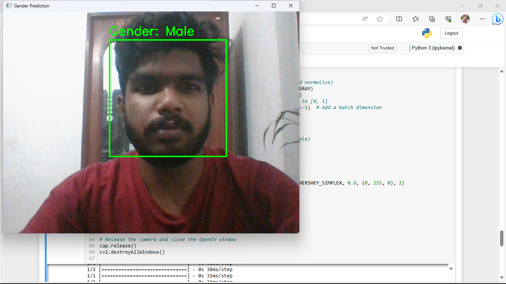

# Gender Prediction with OpenCV and TensorFlow

This project demonstrates how to use OpenCV and TensorFlow to perform real-time gender prediction from a webcam feed. It detects faces in the video stream, extracts face regions, and then predicts the gender of each detected face.

## Prerequisites

Before running this project, make sure you have the following installed:

- Python 3.x
- OpenCV
- TensorFlow
- A trained gender classification model (you can use the provided model or train your own)

You can install the necessary Python packages using pip:

```bash
pip install opencv-python tensorflow

```

## Screenshots


